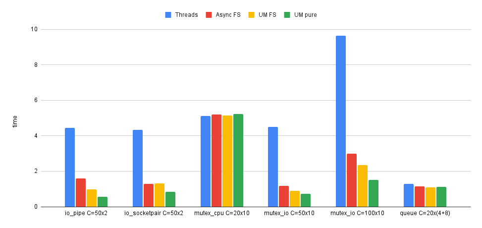

# UringMachine Benchmarks

The following benchmarks measure the performance of UringMachine against stock
Ruby in a variety of scenarios. For each scenario, we compare three different
implementations:

- `Threads`: thread-based concurrency using the stock Ruby I/O and
  synchronization classes.

- `ThreadPool`: thread pool consisting of 10 worker threads, receiving jobs
  through a common queue.

- `Async epoll`: fiber-based concurrency with
  [Async](https://github.com/socketry/async) fiber scheduler, using an epoll
  selector.

- `Async uring`: fiber-based concurrency with Async fiber scheduler, using a
  uring selector.

- `UM FS`: fiber-based concurrency with UringMachine fiber scheduler.

- `UM`: fiber-based concurrency using the UringMachine low-level API.



## Observations

- We see the stark difference between thread-based and fiber-based concurrency.
  For I/O-bound workloads, there's really no contest - and that's exactly why
  the fiber scheduler interface changes everything.

- The UringMachine fiber scheduler is in some cases faster than the Async fiber
  scheduler, but not in all. This might be because the Async FS does scheduling
  of fibers in plain Ruby, while the UMFS implements a runqueue in its
  C-extension.

- The UringMachine low-level API is faster to use in most cases, and its
  performance advantage grows with the level of concurrency. Interestingly, when
  performing CPU-bound work, it seems slightly slightly slower. This should be
  investigated.

- The [pg](https://github.com/ged/ruby-pg) gem supports the use of fiber
  schedulers, and there too we see a marked performance advantage to using
  fibers instead of threads.

According to these benchmarks, for I/O-bound scenarios the different fiber-based
solutions are faster than threads by the following factors:

implementation|average factor
---------------------
Async epoll|x2.36
Async uring|x2.42
UM FS|x2.85
UM|x6.20

## 1. I/O - Pipe

50 groups, where in each group we create a pipe with a pair of threads/fibers
writing/reading 1KB of data to the pipe.

```
C=50x2           user     system      total        real
Threads      2.105002   2.671980   4.776982 (  4.272842)
ThreadPool   4.818014  10.740555  15.558569 (  7.070236)
Async epoll  1.118937   0.254803   1.373740 (  1.374298)
Async uring  1.363248   0.270063   1.633311 (  1.633696)
UM FS        0.746332   0.183006   0.929338 (  0.929619)
UM           0.237816   0.328352   0.566168 (  0.566265)
```

## 2. I/O - Socketpair

50 concurrent groups, where in each group we create a unix socketpair with a
pair of threads/fibers writing/reading 1KB of data to the sockets.

```
C=50x2           user     system      total        real
Threads      2.068122   3.247781   5.315903 (  4.295488)
ThreadPool   2.283882   3.461607   5.745489 (  4.650422)
Async epoll  0.381400   0.846445   1.227845 (  1.227983)
Async uring  0.472526   0.821467   1.293993 (  1.294166)
UM FS        0.443023   0.734334   1.177357 (  1.177576)
UM           0.116995   0.675997   0.792992 (  0.793183)
```

## 3. Mutex - CPU-bound

20 concurrent groups, where in each group we create a mutex and start 10 worker
threads/fibers locking the mutex and performing a Regexp match.

```
C=20x10          user     system      total        real
Threads      5.174998   0.024885   5.199883 (  5.193211)
Async epoll  5.309793   0.000949   5.310742 (  5.311217)
Async uring  5.341404   0.004860   5.346264 (  5.346963)
UM FS        5.363719   0.001976   5.365695 (  5.366254)
UM           5.351073   0.005986   5.357059 (  5.357602)
```

## 4. Mutex - I/O-bound

N concurrent groups, where in each group we create a mutex, open a file and
start 10 worker threads/fibers locking the mutex and writing 1KB chunks to the
file.

```
C=50x10          user     system      total        real
Threads      2.042649   3.441547   5.484196 (  4.328783)
Async epoll  0.810375   0.744084   1.554459 (  1.554726)
Async uring  0.854985   1.129260   1.984245 (  1.140749)
UM FS        0.686329   0.872376   1.558705 (  0.845214)
UM           0.250370   1.323227   1.573597 (  0.720928)
```

## 5. Postgres client

C concurrent threads/fibers, each thread issuing SELECT query to a PG database.

```
C=50             user     system      total        real
Threads      4.304292   1.358116   5.662408 (  4.795725)
Async epoll  2.890160   0.432836   3.322996 (  3.334350)
Async uring  2.818439   0.433896   3.252335 (  3.252799)
UM FS        2.819371   0.443182   3.262553 (  3.264606)
```
## 6. Queue

20 concurrent groups, where in each group we create a queue, start 5 producer
threads/fibers that push items to the queue, and 10 consumer threads/fibers that
pull items from the queue.

```
C=20x(5+10)      user     system      total        real
Threads      4.880983   0.207451   5.088434 (  5.071019)
Async epoll  4.107208   0.006519   4.113727 (  4.114227)
Async uring  4.206283   0.028974   4.235257 (  4.235705)
UM FS        4.082394   0.001719   4.084113 (  4.084522)
UM           4.099893   0.323569   4.423462 (  4.424089)
```
